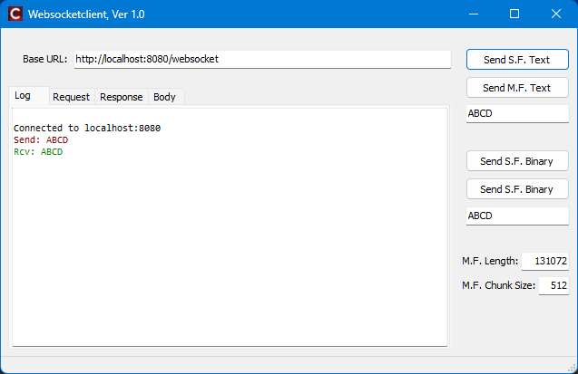
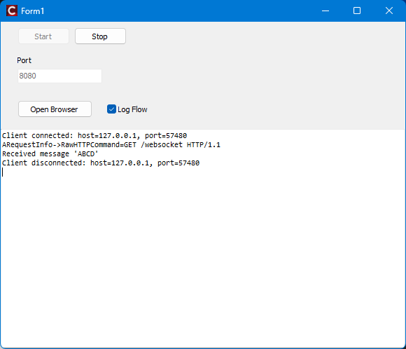

# WebSockets for RAD Studio

A two-file, RFC 6455-compliant WebSocket library for **RAD Studio** (C++ Builder)
built on top of **Indy 10**. Drop `WebSockets.h` and `WebSockets.cpp` into your
project and you have a working WebSocket client or server with no additional
dependencies beyond what ships with RAD Studio.

Compliance has been independently verified with the
[Autobahn|Testsuite](https://github.com/crossbario/autobahn-testsuite) — see
the [RFC 6455 Compliance](#rfc-6455-compliance) section for the full results.

---

## Features

- **Client and server roles** in a single library
- **Text and binary messages**, both single-frame and fragmented (multi-frame)
- **Automatic fragmentation** via `SendMessage` — splits large payloads into
  chunks of a configurable size
- **UTF-8 validation** on received text messages
- **Ping / Pong** frames (send and receive)
- **Close handshake** with status codes and reason text via the full
  `CloseStatus` enum covering all codes defined in RFC 6455 §7.4
- **TLS / SSL** support via the Indy OpenSSL handler (no extra code required —
  just configure `TIdSSLIOHandlerSocketOpenSSL` on your `TIdHTTP`)
- Targets **bcc32c** and **bcc64** (Clang-based compilers)

---

## Requirements

| Requirement | Version |
| --- | --- |
| RAD Studio / C++ Builder | 10.2 Tokyo or later (Clang compiler required) |
| Indy | 10 (bundled with RAD Studio) |
| OpenSSL DLLs | Only for TLS — see [SSL Support](#ssl--tls-support) |

---

## Installation

Copy the two library files into your project (or add them as linked source):

```text
WebSockets.h
WebSockets.cpp
```

Then add the include:

```cpp
#include "WebSockets.h"
```

Everything lives inside the `SvcApp::WebSockets` namespace.

For a deeper API reference, implementation notes, and Mermaid diagrams, see
[`docs/TechnicalDocs.md`](docs/TechnicalDocs.md).

---

## GUI Demos

The [`Demo/GUI`](Demo/GUI/) folder contains two RAD Studio 13 / bcc64x VCL
demo projects:

- [`WebSocketClient`](Demo/GUI/WebSocketClient/) is a VCL client demo that uses
  `SvcApp::WebSockets::Client::WebSocket` with `TIdHTTP`.
- [`WebSocketServer`](Demo/GUI/WebSocketServer/) is a WebBroker/DataSnap server
  demo that uses `SvcApp::WebSockets::Server::WebSocket` through the
  `TIdHTTPWebSocketEnabledWebBrokerBridge` adapter.

The client demo depends on
[Anafestica](https://github.com/gcardi/Anafestica). Install Anafestica in the
appropriate folder under `$(BDSCOMMONDIR)` as described by that project so the
demo include/library paths resolve cleanly. Anafestica is used here to persist
the client parameters under:

```text
Computer\HKEY_CURRENT_USER\Software\Company\VclAppWSClient\1.0\frmMain
```

Client demo:



Server demo:



---

## Usage

### Server

The server side integrates directly with Indy's `TIdHTTPServer`. Construct
`Server::WebSocket` inside your `OnCommandGet` handler and pass the three Indy
context objects. Call `IsWebSocket()` to confirm the upgrade succeeded before
reading or writing.

For WebBroker/DataSnap servers based on `TIdHTTPWebBrokerBridge`, use the
demo's `TIdHTTPWebSocketEnabledWebBrokerBridge` adapter from
`Demo/GUI/WebSocketServer/WSEnabledWebBrokerBridge.*`. That bridge intercepts
the WebSocket endpoint, performs the upgrade, and exposes WebSocket message and
frame events while letting normal HTTP/WebBroker requests continue through the
inherited bridge.

```cpp
#include "WebSockets.h"

using namespace SvcApp::WebSockets;

void __fastcall TMyServer::DoCommandGet(
    TIdContext*           AThread,
    TIdHTTPRequestInfo*   ARequestInfo,
    TIdHTTPResponseInfo*  AResponseInfo )
{
    Server::WebSocket WS( AThread, ARequestInfo, AResponseInfo );

    if ( !WS.IsWebSocket() ) {
        // Not a WebSocket request — handle as normal HTTP
        return;
    }

    // Connection is now upgraded. Read messages in a loop.
    Opcode      Type;
    TBytes      Data;
    CloseStatus CloseReason;
    String      CloseText;

    while ( WS.ReadMessage( Type, Data, CloseReason, CloseText, /*timeout ms*/ 10000 ) ) {
        // Echo the message back
        WS.SendFrame( Type, Data, /*fin*/ true );
    }

    // Peer initiated close, or an error occurred — send close frame and disconnect
    WS.SendCloseFrame( CloseReason, CloseText );
    AThread->Connection->Disconnect();
}
```

#### Frame-level access

If you need access to individual frames rather than reassembled messages (for
example, to forward frames without buffering large payloads), use `ReadFrame`
instead of `ReadMessage`:

```cpp
TBytes Buffer;
size_t PayloadLen {}, PayloadPos {};
CloseStatus CloseReason;
String CloseText;

while ( WS.ReadFrame( Buffer, PayloadLen, PayloadPos, CloseReason, CloseText, 10000 ) ) {
    TBytes Payload = Buffer.CopyRange( PayloadPos, PayloadLen );
    // process or forward Payload
}
```

---

### Client

Construct `Client::WebSocket` by passing a `TIdHTTP` instance and the target
HTTP URL (`http://` or `https://`) to upgrade. The constructor adds the
WebSocket handshake headers and performs the HTTP upgrade immediately. An
exception is thrown if the handshake fails.

```cpp
#include "WebSockets.h"

using namespace SvcApp::WebSockets;

// HTTP object (configure TLS handler on it if connecting to https://)
auto HTTP = std::make_unique<TIdHTTP>( nullptr );

Client::WebSocket WS{ *HTTP, _D( "http://example.com/chat" ) };

// Send a text message (single frame)
WS.SendFrame( _D( "Hello, server!" ) );

// Read the reply
String Reply = WS.ReadTextFrame( /*timeout ms*/ 10000 );

// Send a large text message, fragmented into 4096-byte chunks
CloseStatus CloseReason;
String CloseText;
WS.SendMessage( LargeString, CloseReason, CloseText, /*chunk size*/ 4096, 10000 );

// Close gracefully
WS.SendCloseFrame( CloseStatus::Normal, _D( "Bye!" ) );
```

#### Sending binary data

```cpp
TBytes Payload;
// ... fill Payload ...
WS.SendFrame( Payload );                                              // single frame
WS.SendMessage( Payload, CloseReason, CloseText, 4096, 10000 );      // fragmented
```

#### Passing custom HTTP headers during upgrade

```cpp
auto Headers = std::make_unique<TIdHeaderList>();
Headers->Values[_D( "Authorization" )] = _D( "Bearer <token>" );
```

---

## RFC 6455 Compliance

Compliance was verified using the
[Autobahn|Testsuite](https://github.com/crossbario/autobahn-testsuite) (version
25.10.1-0.10.9) with the profiles in `Test/AutobahnTest/config/`. Performance
stress tests (section 9) and compression extension tests (sections 12–13, which
require `permessage-deflate`) are excluded as compression is not implemented.

| Result | Server | Client | Meaning |
| --- | --- | --- | --- |
| **OK** | 240 | 240 | Full compliance |
| **NON-STRICT** | 4 | 4 | Valid implementation choice (see below) |
| **INFORMATIONAL** | 3 | 3 | Advisory note (see below) |
| **FAILED** | 0 | 0 | — |

**NON-STRICT — cases 6.4.1–6.4.4** (UTF-8 validation in fragmented text messages):
RFC 6455 §8.1 permits an implementation to defer UTF-8 validation until the
final fragment of a fragmented text message has been received. This library
validates the fully reassembled payload rather than each partial frame.
Autobahn considers both approaches conformant; it rates deferred validation as
NON-STRICT rather than OK.

**INFORMATIONAL — cases 7.1.6, 7.13.1, 7.13.2** (TCP connection drop after close):
After completing the WebSocket closing handshake, the spec *recommends* that the
server drop the underlying TCP connection promptly. This library delegates
disconnection to the caller (e.g. `AThread->Connection->Disconnect()`), so the
timing depends on the application. Autobahn records this as informational — it
is not a protocol violation.

Reports are generated into [`Test/AutobahnTest/reports/`](Test/AutobahnTest/reports/)
by the helper scripts. These artifacts are git-ignored; rerun the suite locally
to refresh them.

---

## Running the Tests

The test suite requires [Docker](https://www.docker.com/) (via WSL2 on Windows).
Helper scripts are provided in [`Test/AutobahnTest/scripts/`](Test/AutobahnTest/scripts/).
A validated Windows + WSL2 runbook is available in
[`Test/AutobahnTest/README.md`](Test/AutobahnTest/README.md).

### Server role test (Autobahn acts as client, hammers your server)

1. Build and start `Test/AutobahnTest/EchoServer/TestEchoServer.cbproj` — it
   listens on port 9001.
2. From WSL2:

```bash
cd /path/to/Test/AutobahnTest
./scripts/run_server_test.sh
```

Reports are written to `reports/server/`.

### Client role test (Autobahn acts as server, your client connects to it)

1. From WSL2, start the Autobahn fuzzing server:

```bash
cd /path/to/Test/AutobahnTest
./scripts/run_client_test.sh
```

1. Build and run `Test/AutobahnTest/TestClient/TestClient.cbproj` (or the
   pre-built executable). It connects to `localhost:9001`, iterates all cases,
   then triggers report generation.
Reports are written to `reports/client/`.

---

## SSL / TLS Support

For secure WebSocket connections on the client side, attach a
`TIdSSLIOHandlerSocketOpenSSL` to your `TIdHTTP` before constructing
`Client::WebSocket`, and pass an `https://` URL:

```cpp
auto SSL = std::make_unique<TIdSSLIOHandlerSocketOpenSSL>( nullptr );
SSL->SSLOptions->Method = sslvTLSv1_2;
SSL->PassThrough = false;
HTTP->IOHandler = SSL.get();

Client::WebSocket WS{ *HTTP, _D( "https://secure.example.com/ws" ) };
```

The WebSocket library does not perform certificate validation by itself.
Production secure WebSocket clients must configure peer verification, trust anchors,
and hostname checks on Indy / OpenSSL. If certificate verification is disabled,
the connection still encrypts traffic but does not authenticate the peer.

For the server side, configure SSL on the `TIdHTTPServer` /
`TIdHTTPWebBrokerBridge` as you normally would with Indy — no changes to the
WebSocket code are needed.

## Handshake Hardening

Server-side handshakes can be tightened with `Server::HandshakeOptions`.
This lets you move origin checks, subprotocol negotiation, and optional
extension rejection into the library instead of leaving them as ad hoc
application code:

```cpp
TStringList AllowedOrigins;
AllowedOrigins.Add( _D( "https://app.example.com" ) );

TStringList AllowedSubprotocols;
AllowedSubprotocols.Add( _D( "chat.v1" ) );

SvcApp::WebSockets::Server::HandshakeOptions Options;
Options.AllowedOrigins = &AllowedOrigins;
Options.AllowedSubprotocols = &AllowedSubprotocols;
Options.RequireOrigin = true;
Options.RejectExtensions = true;

SvcApp::WebSockets::Server::WebSocket WS(
  AThread,
  ARequestInfo,
  AResponseInfo,
  &Options
);

if ( !WS.IsWebSocket() ) {
  return;
}

auto const NegotiatedSubprotocol = WS.GetAcceptedSubprotocol();
```

Defaults remain backward-compatible. The library now validates
`Sec-WebSocket-Key` strictly, while origin and extension policy checks stay
opt-in because only the application knows its trust boundary.

Place your certificate files in `Demo/Resources/SSL/`:

```text
Demo/Resources/SSL/ca.crt
Demo/Resources/SSL/ca.key
Demo/Resources/SSL/caRoot.pem
```

OpenSSL 1.0.2 DLLs for Win32 and Win64 are included in the demo resources
folder for convenience.

---

## License

MIT — see [LICENSE](LICENSE).
