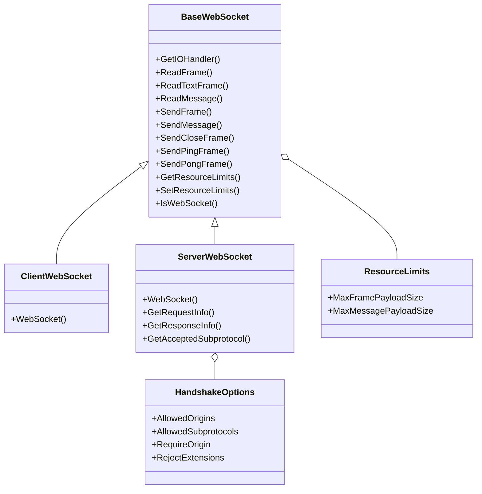
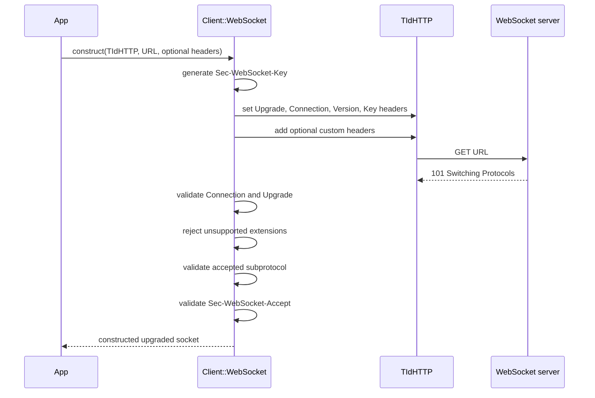
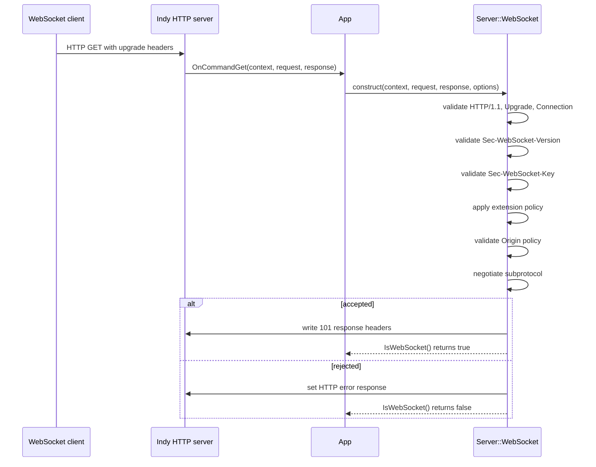
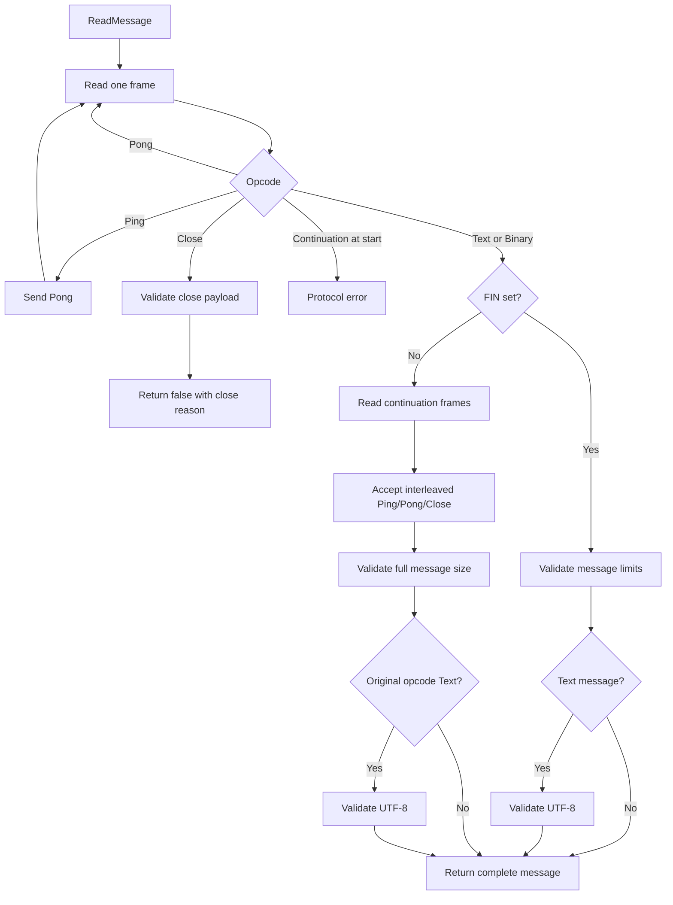

# Technical Documentation

This document describes the public API and internal protocol flow of the
`WebSockets.*` module. The library is intentionally small: `WebSockets.h`
contains the public API, and `WebSockets.cpp` contains the RFC 6455 frame,
message, and handshake implementation.

The code is designed for RAD Studio / C++Builder applications that already use
Indy. Client connections are built on `TIdHTTP`; simple server connections can
be built directly on `TIdHTTPServer`.

WebBroker/DataSnap servers need a small adapter around
`TIdHTTPWebBrokerBridge`, because normal WebBroker request dispatch does not by
itself own the long-running WebSocket read loop. The demo provides that adapter
as `TIdHTTPWebSocketEnabledWebBrokerBridge` in
`Demo/GUI/WebSocketServer/WSEnabledWebBrokerBridge.*`.

## Module Layout

```text
SvcApp
  WebSockets
    Opcode
    CloseStatus
    ResourceLimits
    WebSocket
    Client
      WebSocket
    Server
      HandshakeOptions
      WebSocket
```

The common `SvcApp::WebSockets::WebSocket` class implements the role-neutral
message API. `Client::WebSocket` and `Server::WebSocket` provide the role
specific handshake, frame masking rules, and Indy object integration.

## Class Diagram



## Public Types

### `Opcode`

`Opcode` represents the RFC 6455 frame opcode:

| Value | Meaning |
| --- | --- |
| `Continuation` | Continuation frame in a fragmented message. |
| `Text` | UTF-8 text data frame. |
| `Binary` | Binary data frame. |
| `Close` | Close control frame. |
| `Ping` | Ping control frame. |
| `Pong` | Pong control frame. |

`ToString(Opcode)` converts a known opcode to a readable `String`.

### `CloseStatus`

`CloseStatus` contains the RFC 6455 close codes from 1000 through 1015,
including reserved values. `ToCloseStatus(uint16_t, CloseStatus&)` maps a
numeric code to a known enum value when possible.

Only valid on-the-wire close codes may be sent with `SendCloseFrame`. The
implementation rejects reserved values such as 1005, 1006, and 1015 when used
as outgoing close frame status codes.

### `ResourceLimits`

`ResourceLimits` constrains how much data the reader accepts:

| Field | Default | Meaning |
| --- | ---: | --- |
| `MaxFramePayloadSize` | 64 MiB | Maximum payload size for a single frame. |
| `MaxMessagePayloadSize` | 64 MiB | Maximum reassembled message size. |

Call `SetResourceLimits` before reading from the socket to change these values.
Both values must be greater than zero.

## Base `WebSocket` API

The base class owns the role-neutral behavior shared by clients and servers.
It is abstract because the two roles use different masking rules and different
Indy owner objects.

### Frame Reading

```cpp
bool ReadFrame(
    TBytes& InBuffer,
    size_t& PayloadLen,
    size_t& PayloadPos,
    CloseStatus& CloseReason,
    String& CloseText,
    int Timeout
);
```

`ReadFrame` reads one WebSocket frame into `InBuffer`. On success,
`PayloadPos` and `PayloadLen` identify the payload slice within the buffer.

Use this API when the caller needs frame-level access, such as forwarding
frames, implementing custom streaming behavior, or inspecting control frames.
Most applications should prefer `ReadMessage`.

The method sets the underlying Indy `ReadTimeout` before reading.

### Message Reading

```cpp
bool ReadMessage(
    Opcode& Type,
    TBytes& Data,
    CloseStatus& CloseReason,
    String& CloseText,
    int Timeout
);
```

`ReadMessage` reads and reassembles a complete text or binary message. It also
handles fragmented messages internally.

While reading, the implementation automatically responds to ping frames with a
pong frame. Pong frames are consumed. Close frames stop the read and return
`false`, with `CloseReason` and `CloseText` populated when the close payload is
valid.

For text messages, the reassembled payload is validated as UTF-8. Invalid UTF-8
causes `ReadMessage` to fail with `CloseStatus::InconsistentData`.

### Text Reading

```cpp
bool ReadTextFrame(
    int Timeout,
    String& Text,
    String& CloseText,
    CloseStatus& CloseReason
);

String ReadTextFrame( int Timeout );
```

The boolean overload reads a complete message and succeeds only when the
message opcode is `Opcode::Text`. The throwing overload returns the text or
raises an exception if the socket closes or a non-text message is encountered.

### Sending Frames

```cpp
void SendFrame( Opcode Type, TBytes const & Data, bool Fin );
void SendFrame( String Text, bool Fin = true );
void SendFrame( TBytes const & Data, bool Fin = true );
void SendEmptyFrame( Opcode Type );
```

`SendFrame` writes one WebSocket frame. The `String` overload sends UTF-8 text;
the `TBytes` overload sends binary data. Set `Fin` to `false` only when sending
fragmented data manually.

For normal application messages, use `SendFrame` for small single-frame
messages and `SendMessage` for automatic fragmentation.

### Sending Messages

```cpp
void SendMessage(
    Opcode Type,
    TBytes const & Data,
    CloseStatus& CloseReason,
    String& CloseText,
    size_t MaxChunkSize,
    int Timeout
);
```

`SendMessage` sends a complete text or binary message. If `Data.Length` is
larger than `MaxChunkSize`, it sends the first frame with the original opcode
and each following frame as `Opcode::Continuation`.

`MaxChunkSize` must be greater than zero. The method sets the underlying Indy
`ReadTimeout` before sending because it may briefly check for incoming control
frames between outgoing fragments.

### Control Frames

The base class exposes convenience methods for close, ping, and pong frames:

```cpp
void SendCloseFrame();
void SendCloseFrame( CloseStatus CloseReason, TBytes const & CloseData );
void SendCloseFrame( CloseStatus CloseReason, String CloseText );

void SendPingFrame();
void SendPingFrame( TBytes const & Data );
void SendPingFrame( String Text );

void SendPongFrame();
void SendPongFrame( TBytes const & Data );
void SendPongFrame( String Text );
```

Close reason text is encoded as UTF-8. Since WebSocket control frame payloads
are limited to 125 bytes and the status code uses 2 bytes, close reason data is
limited to 123 bytes.

## Client API

`SvcApp::WebSockets::Client::WebSocket` wraps an existing `TIdHTTP`.

```cpp
Client::WebSocket(
    TIdHTTP& IdHTTP,
    String URL,
    Idheaderlist::TIdHeaderList* AdditionalCustomHeader = nullptr
);
```

The constructor performs the HTTP upgrade immediately. If the upgrade fails,
it throws an exception.

Pass an `http://` or `https://` URL to this constructor. `Client::WebSocket`
uses `TIdHTTP` to send the HTTP request, then adds the WebSocket upgrade headers
internally. The logical WebSocket endpoint is the same path after the server
accepts the upgrade.

The caller owns the `TIdHTTP` instance and must keep it alive for the lifetime
of the `Client::WebSocket`.

### Client Upgrade Flow



Client frames sent by the library are masked, as required by RFC 6455. Incoming
server frames must not be masked; masked frames from the server are treated as a
protocol error.

The client validates:

- HTTP status `101`.
- `Connection: Upgrade`.
- `Upgrade: websocket`.
- No unsupported `Sec-WebSocket-Extensions` value.
- Any accepted subprotocol was actually offered by the caller.
- `Sec-WebSocket-Accept` matches the generated key.

## Server API

`SvcApp::WebSockets::Server::WebSocket` adapts Indy HTTP server request
objects to a WebSocket connection.

```cpp
Server::WebSocket(
    Idcontext::TIdContext* AThread,
    Idcustomhttpserver::TIdHTTPRequestInfo* ARequestInfo,
    Idcustomhttpserver::TIdHTTPResponseInfo* AResponseInfo,
    HandshakeOptions const * AOptions = nullptr
);
```

The constructor attempts the upgrade immediately. Unlike the client
constructor, it does not throw for normal handshake rejection. Call
`IsWebSocket()` after construction to check whether the request was upgraded.

The caller owns the Indy objects and must keep them valid for the lifetime of
the `Server::WebSocket`.

### WebBroker Bridge Adapter

For a plain `TIdHTTPServer`, application code can construct
`Server::WebSocket` directly in the server's `OnCommandGet` handler. The
console server example below uses this approach.

For WebBroker/DataSnap applications based on `TIdHTTPWebBrokerBridge`, use the
demo adapter:

```cpp
#include "WSEnabledWebBrokerBridge.h"

using ServerType = SvcApp::TIdHTTPWebSocketEnabledWebBrokerBridge;
```

`TIdHTTPWebSocketEnabledWebBrokerBridge` derives from `TIdHTTPWebBrokerBridge`
and overrides `DoCommandGet`. Requests whose document path is not `/websocket`
are delegated to the inherited WebBroker bridge. Requests for `/websocket` are
handled by `DoWebSocketCommand`, which constructs
`SvcApp::WebSockets::Server::WebSocket`, performs the server-side handshake,
enters the WebSocket read loop, and disconnects the Indy context when the
conversation ends.

The adapter exposes these WebSocket-specific events:

| Event | Purpose |
| --- | --- |
| `OnCommandGet` | Optional pre-processing hook; set `Handled` to bypass normal bridge/WebSocket dispatch. |
| `OnWebSocketFrameReceived` | Frame-level callback for applications that need raw frame payload handling. |
| `OnWebSocketMessageReceived` | Message-level callback for normal text/binary WebSocket messages. |

The demo form uses `OnWebSocketMessageReceived` to receive a fully reassembled
message and echo a response through the supplied `Server::WebSocket` instance.
It also calls `ConfigureLoopbackHandshake(Port)` before activating the server,
which prepares loopback origins and configures the bridge's default handshake
options to reject unsupported extensions.

## GUI Demo Projects

The `Demo/GUI` folder contains two VCL projects that exercise the library from
both sides of a local WebSocket connection.

### `Demo/GUI/WebSocketClient`

`WebSocketClient` is a VCL client demo built around `TIdHTTP` and
`SvcApp::WebSockets::Client::WebSocket`. It can send single-frame text and
binary messages, and it can also send fragmented text messages through
`SendMessage`.


The project depends on
[Anafestica](https://github.com/gcardi/Anafestica). Install Anafestica in the
appropriate folder under `$(BDSCOMMONDIR)` as described by the Anafestica
documentation. The demo project include/library paths are set up to find
Anafestica from that common RAD Studio location.

Anafestica provides the form persistence used by the client demo. The persisted
parameters include the target URL, text payload, binary payload, fragmented
message length, and fragment size. They are stored in the registry under:

```text
Computer\HKEY_CURRENT_USER\Software\Company\VclAppWSClient\1.0\frmMain
```

The client also sends an `Origin` header during the WebSocket upgrade. This is
important when talking to the GUI server demo, because the server bridge uses a
loopback origin allow-list.

### `Demo/GUI/WebSocketServer`

`WebSocketServer` is a VCL WebBroker/DataSnap server demo. It uses
`TIdHTTPWebSocketEnabledWebBrokerBridge` and the `WebSockets` unit to serve a
normal WebBroker application and a WebSocket endpoint from the same Indy HTTP
server.


The bridge intercepts requests for `/websocket`, creates a
`SvcApp::WebSockets::Server::WebSocket`, and dispatches received WebSocket
messages to the demo form through `OnWebSocketMessageReceived`. Other requests
continue through the inherited WebBroker bridge.

The server calls `ConfigureLoopbackHandshake(Port)` before activation. This
allows loopback origins such as `http://localhost:<port>` and
`http://127.0.0.1:<port>`, and rejects unsupported WebSocket extensions.

### `HandshakeOptions`

```cpp
struct HandshakeOptions {
    TStrings* AllowedOrigins { nullptr };
    TStrings* AllowedSubprotocols { nullptr };
    bool RequireOrigin { false };
    bool RejectExtensions { false };
};
```

`AllowedOrigins` enables origin allow-list validation. If the list is present
and non-empty, requests with no `Origin` header are rejected. If `RequireOrigin`
is true, requests without `Origin` are also rejected even when no allow-list is
configured.

`AllowedSubprotocols` enables subprotocol negotiation. When the client offers
subprotocols and the allow-list is present, the first offered token that appears
in the allow-list is accepted. If no offered token is allowed, the handshake is
rejected.

`RejectExtensions` rejects requests that include `Sec-WebSocket-Extensions`.
The library does not implement compression or other extensions.

### Server Upgrade Flow



Server frames sent by the library are not masked, as required by RFC 6455.
Incoming client frames must be masked; unmasked frames from the client are
treated as a protocol error.

## Message Processing Flow



The reader treats protocol violations as failed reads and provides an
appropriate `CloseReason` and `CloseText` where possible. Some failures also
cause the implementation to send a close frame before returning.

## Protocol Behavior

### Frame Validation

The implementation validates the frame header before reading the payload:

- RSV bits must be zero because no extensions are negotiated.
- Unknown opcodes are rejected.
- Control frames must have `FIN` set.
- Control frame payload length must be less than 126 bytes.
- Payload length must not exceed `MaxFramePayloadSize`.
- Client-received frames must be unmasked.
- Server-received frames must be masked.

### Fragmentation

`ReadMessage` reassembles fragmented text and binary messages. Control frames
may appear between fragments and are handled according to their opcode.

`SendMessage` fragments outgoing data when `Data.Length` exceeds
`MaxChunkSize`. The first frame uses the requested data opcode, and subsequent
frames use `Opcode::Continuation`.

### UTF-8 Validation

Text messages are validated after full message reassembly. This means
fragmented text messages are checked once all fragments have been received.
Close reason text is also validated as UTF-8.

The validator rejects overlong encodings, surrogate code points, incomplete
sequences, invalid continuation bytes, and code points above `U+10FFFF`.

### Close Handling

`ReadMessage` returns `false` when a close frame is received. If the close
payload contains a valid close code and optional UTF-8 reason, the output
parameters are populated.

`SendCloseFrame(CloseStatus, ...)` validates that the status code is allowed on
the wire and that the close data fits in a control frame.

The library performs the WebSocket close frame exchange, but the application is
responsible for closing the underlying TCP connection at the appropriate time.
On the server side, this usually means calling `AThread->Connection->Disconnect()`
after sending the close response.

## Ownership and Lifetime

The WebSocket wrapper classes store references to Indy objects; they do not own
those objects.

| Class | Referenced objects | Owner |
| --- | --- | --- |
| `Client::WebSocket` | `TIdHTTP` and its `IOHandler` | Caller |
| `Server::WebSocket` | `TIdContext`, `TIdHTTPRequestInfo`, `TIdHTTPResponseInfo` | Indy / caller |

Do not destroy or reuse the referenced Indy objects while a `WebSocket` wrapper
is still active.

## Typical Server Loop

```cpp
using namespace SvcApp::WebSockets;

Server::WebSocket WS( AThread, ARequestInfo, AResponseInfo );
if ( !WS.IsWebSocket() ) {
    return;
}

Opcode Type;
TBytes Data;
CloseStatus CloseReason { CloseStatus::Normal };
String CloseText;

while ( WS.ReadMessage( Type, Data, CloseReason, CloseText, 10000 ) ) {
    WS.SendFrame( Type, Data, true );
}

WS.SendCloseFrame( CloseReason, CloseText );
AThread->Connection->Disconnect();
```

## Typical Client Flow

```cpp
using namespace SvcApp::WebSockets;

auto HTTP = std::make_unique<TIdHTTP>( nullptr );
Client::WebSocket WS( *HTTP, _D( "http://example.com/chat" ) );

WS.SendFrame( _D( "hello" ) );

String Text;
String CloseText;
CloseStatus CloseReason { CloseStatus::Normal };

if ( WS.ReadTextFrame( 10000, Text, CloseText, CloseReason ) ) {
    // Use Text.
}

WS.SendCloseFrame( CloseStatus::Normal, _D( "done" ) );
```

## Console Application Examples

The following examples are complete `main.cpp` files for C++Builder console
applications. They assume `WebSockets.h` and `WebSockets.cpp` have been added
to the project.

The examples use a plain HTTP endpoint that is upgraded to WebSocket. With this
library's Indy client wrapper, pass an `http://` URL to `TIdHTTP`; the wrapper
adds the WebSocket upgrade headers before calling `TIdHTTP::Get`. For TLS, use
`https://` and configure the appropriate Indy SSL IO handler before opening the
connection.

For new RAD Studio console projects, use the Unicode `TCHAR` setting so
`_TCHAR` maps to `wchar_t`. The examples use `_tmain`, `_TCHAR`, `_ttoi`, and
wide `String::c_str()` output, matching the repository's bcc64x console test
projects. If a project is intentionally configured with narrow `TCHAR`, either
switch it to Unicode or replace the entry point with a narrow `main` signature
and convert command-line arguments explicitly.

### Echo Server with `TIdHTTPServer`

This console application starts a WebSocket echo server on
`ws://127.0.0.1:9001/`. It accepts WebSocket upgrade requests, echoes text and
binary messages, and replies to the peer's close frame before disconnecting.

```cpp
#include <System.SysUtils.hpp>
#include <tchar.h>
#include <cstdio>
#include <IdContext.hpp>
#include <IdCustomHTTPServer.hpp>
#include <IdHTTPServer.hpp>

#include "WebSockets.h"

class TEchoServer final : public TObject {
public:
    void __fastcall CommandGet(
        Idcontext::TIdContext* AContext,
        Idcustomhttpserver::TIdHTTPRequestInfo* ARequestInfo,
        Idcustomhttpserver::TIdHTTPResponseInfo* AResponseInfo )
    {
        using namespace SvcApp::WebSockets;

        Server::HandshakeOptions Options;
        Options.RejectExtensions = true;

        Server::WebSocket WS(
            AContext,
            ARequestInfo,
            AResponseInfo,
            &Options
        );

        if ( !WS.IsWebSocket() ) {
            AResponseInfo->ResponseNo = 400;
            AResponseInfo->ContentText = _D( "WebSocket connections only" );
            return;
        }

        Opcode Type;
        TBytes Data;
        CloseStatus CloseReason { CloseStatus::Normal };
        String CloseText;

        try {
            while ( WS.ReadMessage(
                        Type,
                        Data,
                        CloseReason,
                        CloseText,
                        30000 ) )
            {
                switch ( Type ) {
                    case Opcode::Text:
                    case Opcode::Binary:
                        WS.SendFrame( Type, Data, true );
                        break;

                    default:
                        break;
                }
            }

            WS.SendCloseFrame( CloseReason, CloseText );
        }
        catch ( Exception const & E ) {
            std::printf( "WebSocket error: %ls\n", E.Message.c_str() );
        }
        catch ( ... ) {
        }

        AContext->Connection->Disconnect();
    }
};

int _tmain( int argc, _TCHAR* argv[] )
{
    int Port = 9001;
    if ( argc > 1 ) {
        Port = _ttoi( argv[1] );
    }

    auto Handler = new TEchoServer();
    auto Server = new TIdHTTPServer( nullptr );

    try {
        Server->OnCommandGet = Handler->CommandGet;
        Server->DefaultPort = Port;
        Server->Active = true;

        std::printf(
            "WebSocket echo server listening on ws://127.0.0.1:%d/\n"
            "Press Enter to stop.\n",
            Port
        );
        std::getchar();

        Server->Active = false;
    }
    catch ( Exception const & E ) {
        std::printf( "Failed: %ls\n", E.Message.c_str() );
    }

    delete Server;
    delete Handler;

    return 0;
}
```

### Client with `TIdHTTP`

This console application connects to the echo server above, sends one text
message, reads the echoed reply, and closes the WebSocket cleanly. It uses an
`http://` URL because `Client::WebSocket` performs the WebSocket upgrade through
`TIdHTTP`.

```cpp
#include <System.SysUtils.hpp>
#include <tchar.h>
#include <cstdio>
#include <IdHTTP.hpp>

#include <memory>

#include "WebSockets.h"

int _tmain( int argc, _TCHAR* argv[] )
{
    try {
        using namespace SvcApp::WebSockets;

        String URL = _D( "http://127.0.0.1:9001/" );
        if ( argc > 1 ) {
            URL = argv[1];
        }

        auto HTTP = std::make_unique<TIdHTTP>( nullptr );
        Client::WebSocket WS( *HTTP, URL );

        String const Message = _D( "Hello from a C++Builder console client" );
        WS.SendFrame( Message );

        String Reply;
        String CloseText;
        CloseStatus CloseReason { CloseStatus::Normal };

        if ( WS.ReadTextFrame( 10000, Reply, CloseText, CloseReason ) ) {
            std::printf( "Received: %ls\n", Reply.c_str() );
        }
        else {
            std::printf(
                "Closed while waiting for reply: %d %ls\n",
                static_cast<int>( CloseReason ),
                CloseText.c_str()
            );
        }

        WS.SendCloseFrame( CloseStatus::Normal, _D( "done" ) );
    }
    catch ( Exception const & E ) {
        std::printf( "Failed: %ls\n", E.Message.c_str() );
        return 1;
    }

    return 0;
}
```

## Notes for Maintainers

- Keep public API changes in `WebSockets.h` reflected in this document.
- Update the Mermaid class diagram when adding public types or public methods.
- Prefer documenting observable behavior here and implementation-only details
  in source comments.
- Doxygen can still be added later for generated symbol reference, but this
  Markdown file should remain the primary human-readable API guide.
